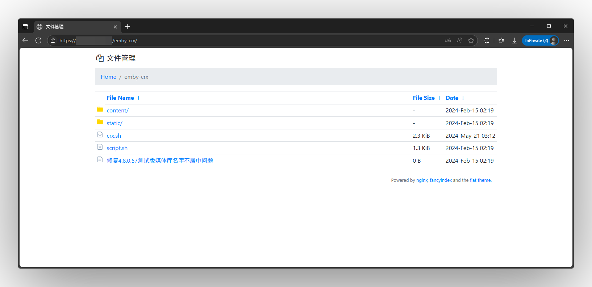

## 项目修改
1. 集成nginx配置和主题文件
2. 主题进行了图标优化和系统汉化
3. 使用Docker安装

## 参考github项目：

[自带fancyindex的docker镜像](https://github.com/shiharuharu/docker-nginx-fancyindex)

[Fancyindex-主题](https://github.com/alehaa/nginx-fancyindex-flat-theme)

## 安装
```
docker run -d \
 --restart=always \
 --name="01-nginx-file" \
 -p 6008:80 \
 # -v /已经预设:/etc/nginx/http.d/file.conf \
 -v /path/to/your/www:/www/config \
nobody114/nginx-fancyindex:latest
```

## 截图
